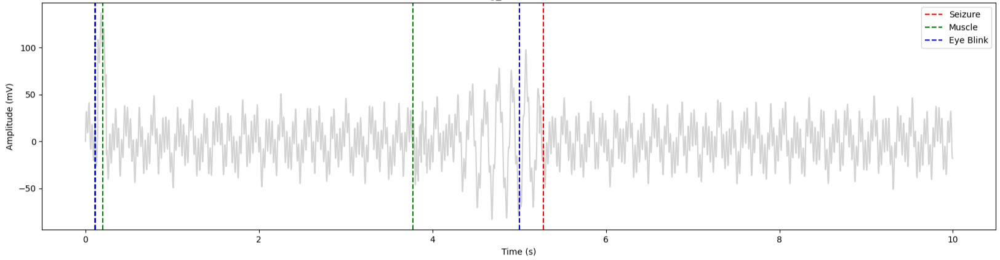

# Brain EEG Signal Processing

Analysis and evaluation of [EEG](https://en.wikipedia.org/wiki/Electroencephalography) samples using theories, algorithms, techniques and methodologies involved in signal processing.  
Complete with algorithms for detecting the following artifacts inside the samples and marking their onset:  

- Eye Blinks
- Muscle Movements
- Seizures

Algorithms and analysis are found in [notebook.ipynb](notebook.ipynb)



## Installation

- Install [uv](https://github.com/astral-sh/uv) package manager.

- Install required dependencies
```bash
uv sync
```

Alternatively [requirements.txt](./requirements.txt) has also been generated if uv cannot be used.